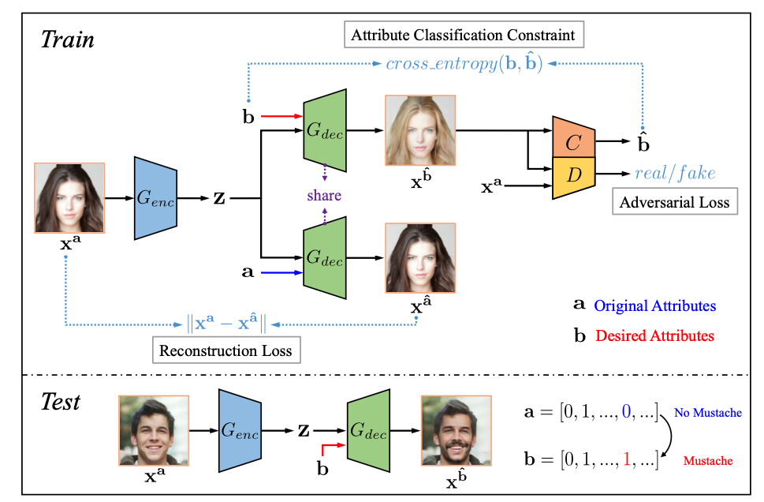

# self-driving-AttGAN
- Unofficial Tensorflow implementation of [Attribute-Controlled Traffic Data Augmentation Using Conditional Generative Models](docs/attn-gan-data-aug.pdf)
- University project [presentation (PDF)](docs/presentation.pdf). Explains the gist of the paper.

## Prerequisites
* Python 3.6
* Tensorflow-gpu 1.14

# Get data

```
bash resources/get_train_data.sh (~ 4.7 GB)
bash resources/get_test_data.sh (~1.8 GB)
```

# Custom Training

```
$ python3 code/train.py
    --batch_size 128
    --num_classes 2
    --lr_g 0.0002
    --lr_d 0.005
    --model_name None
    --truncated False
    --rand_seed 42
```


# Testing

```
$ python3 code/test.py
    --batch_size 128 -- default the number of images to generate
    --num_classes 2
    --model_name -- no default, download model and place in 'models/checkpoints'
    --truncated False
    --rand_seed 42
```


## sample run for 120 epochs


# Architecture:

 

## TO DO:

- explore time-of-day interpolation
- requirements.txt file
- upload pre-trained model (google drive)

# References

- Original attribute GAN paper  [AttGAN: Facial Attribute Editing by Only Changing What You Want](docs/attn-gan-orig.pdf)